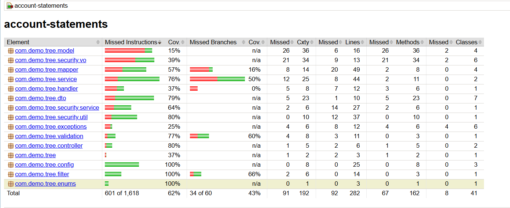
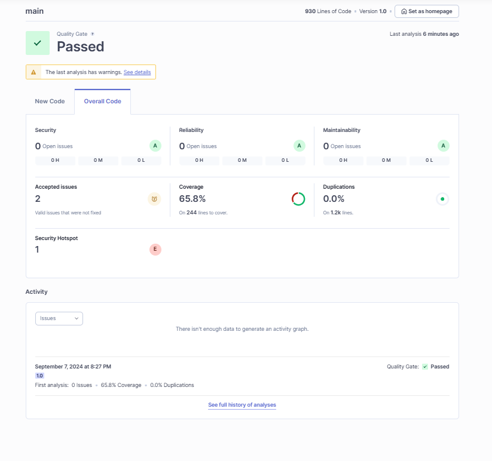

# account statements service

### Used Technologies & Tools:

* Java17
* Spring boot 3.3.3
* Spring Validation
* Spring JPA
* MS Access DB
* Spring Cache
* Spring Security and JWT
* Mapstruct
* Project Lombok
* Docker
* jacoco
* SonarQube
* IntelliJ
* Tomcat server

### Business Logic:

* the service had 2 roles USER and ADMIN
* each of them can login with his credentials
* admin can perform account statements filter request with criteria:
    * account id
    * statement date range (dateFrom:dateTo)
    * statement amount range (amountFrom:amountTo)
* admin can perform account statements filter request with only the account id and will got result of the last 3 months

### APIs:

* login API
* logout API
* filter account statements API

### Test Cases:

an integration test that cover below cases:

* test login request with a user
* test login request with an admin
* test account filter request with a user
* test account filter request with an admin
* test login twice with a user

### Running Test Cases:

with below mvn commands one by one to install the required dependencies, run the test cases, and prepare the test
coverage report

* mvn clean install
* mvn clean test
* mvn jacoco:report

## Test Coverage Report

## SonarQube Report

